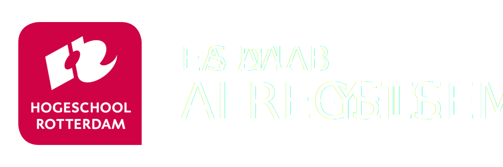

<div align="center">
  
</div>


[](https://www.nxp.com/design/development-boards/freedom-development-boards/freedom-development-platform-for-mcx-n-series:FRDM-MCXN947)
[](https://www.tensorflow.org/)

**Welkom bij de repository van het HR Datalab voor het project *AI-regelsysteem*.**

Hogeschool Rotterdam biedt binnen de cursus *Digitale Systemen (DIS10)* een opstelling aan waarbij een pingpongbal op een ingestelde hoogte wordt gehouden. Deze opstelling bestaat uit een verticale buis met onderaan een ventilator. Door de luchtdruk van de ventilator wordt de bal omhoog geblazen. Met behulp van een microcontroller wordt de ventilator aangestuurd, zodat de bal op de gewenste hoogte blijft zweven.  

De regeling van de ventilatorsnelheid gebeurt momenteel met een PID-regelaar (*Proportioneel-Integrerend-Differentieel*), waarbij de afwijking tussen de gewenste en werkelijke hoogte continu wordt bijgestuurd. Hoewel deze opstelling naar behoren functioneert, is het instellen van de PID-parameters vaak een handmatig en tijdrovend proces om het systeem stabiel te laten reageren op hoogteveranderingen. Bovendien kunnen veranderingen in de omgeving (zoals temperatuur of luchtvochtigheid) de prestaties van de PID-regelaar beïnvloeden.  

De begeleidende docent heeft daarom de vraag gesteld of deze traditionele regelmethode kan worden vervangen door een benadering gebaseerd op *machine learning*. Machine learning biedt de mogelijkheid om op basis van data te leren hoe het systeem zich moet gedragen. In dit project wordt onderzocht of het mogelijk is een machine learning-model te ontwikkelen dat het gedrag van de PID-regelaar kan nabootsen of zelfs verbeteren.  

> ℹ️ Let op: dit project is nog in ontwikkeling.

> Deze repository is nog in de beginfase en zal in de loop van de tijd worden uitgebreid met meer documentatie, code en resultaten.
  
# Inhoudsopgave
- [Inhoudsopgave](#inhoudsopgave)
- [Projectdoelen](#projectdoelen)
- [Gebruik](#gebruik)
  - [Installatie](#installatie)
- [Resultaten](#resultaten)
  - [🧑‍🤝‍🧑 Bijdragen van Eerdere Projectgroepen](#-bijdragen-van-eerdere-projectgroepen)
- [Auteurs / Credits](#auteurs--credits)
- [Contributie](#contributie)
- [Licentie](#licentie)

# Projectdoelen

- ✅ Eerste AI-model gebaseerd op PID-regelaar
- ✅ PID simulatie met dataverzameling
- 🔜 Hardware-integratie

# Gebruik

Deze repository is bedoelt voor studenten/docenten van het EAS datalab

## Installatie

```bash
git clone https://github.com/HR-DataLab-EAS/AI-Regelsysteem.git
cd AI-Regelsysteem
```


# Resultaten

## 🧑‍🤝‍🧑 Bijdragen van Eerdere Projectgroepen

Omdat dit project over meerdere semesters en groepen verdeeld is, hebben we een overzicht gemaakt van alle bijdragen:

| Projectgroep | Periode    | Bijdrage                                | Link/Bestanden              |
|--------------|------------|------------------------------------------|------------------------------|
| Groep A      | Q1_2025 - Q2_2025  | Eerste AI-model + datasetverzameling + Simulatie PID         | [`/docs/groepA/`](docs/Groep_A) |
| Groep B  (huidige)    | Q3_2025 - Q4_2025  |      | [`/docs/groepB/`](docs/Groep_B) |

# Auteurs / Credits

<details>
  <summary>EAS Datalab</summary>

  | Naam          | Rol               | Contact                |
|---------------|-------------------------------|------------------------|
| Groot Nibbelink     | Project begeleider          | [s.groot.nibbelink@hr.nl](mailto:s.groot.nibbelink@hr.nl) |
| Mitchel Reints     | Junior tech lead       | [1040953@hr.nl](mailto:1040953@hr.nl)                   |


</details>
<details>

  <summary>Groep A</summary>

  | Naam          | Rol / Bijdrage                | Contact                |
|---------------|-------------------------------|------------------------|
| Mitchel Reints     | AI-model & simulatie          | [1040953@hr.nl](mailto:1040953@hr.nl) |
| Thomas van Ommeren     | Hardware-implementatie        | [1033239@hr.nl](mailto:1033239@hr.nl) |
| Yered Scheffer     | eIQ Toolkit          | [1048873@hr.nl](mailto:1048873@hr.nl) |
| Piet Poot     | eIQ Toolkit & Hardware          | [1023763@hr.nl](mailto:1023763@hr.nl) |

</details>

# Contributie

Pull requests zijn welkom! Volg alstublieft onze [contributie-richtlijnen](CONTRIBUTING.md).

# Licentie

Dit project valt onder de Apache 2.0 licentie. Zie [LICENSE](LICENSE).

<br>

---

<details>
  <summary>klik voor repository file structuur</summary>
  
  ```plaintext
ai-regelsysteem/
├── Archive/
├── docs/
├────────groepA/
├────────groepB/
├── contributing
├── LICENSE
├── README.md
```

</details>
